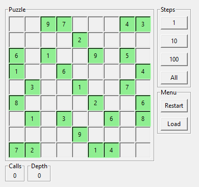

# Sudoku solving program

It have nice gui so just load map and have fun.

- Calls - how many times solving function have been called (placed number)
- Depth - depth of recursion

You can add your own sudoku using text editor just look at maps folder and open one of .sudoku file
